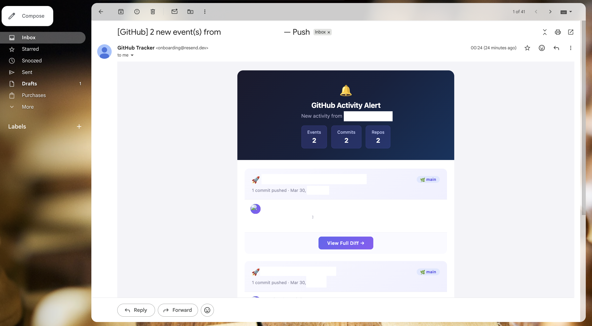
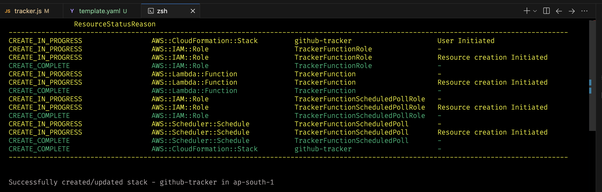

# GitHub Activity Tracker



A beautifully simple, entirely serverless AWS Lambda function that monitors a GitHub user account for new activity and sends visually rich, professionally formatted HTML email updates when public events (like commits, PRs, issues) are detected.

It dynamically pulls secrets from AWS SSM during execution, keeping credentials entirely safe and off your servers. Driven by an AWS EventBridge scheduler, this system requires zero operational overhead or constantly running servers.

## Features
- **Serverless & Stateless**: Runs on AWS Lambda, scaling instantly and costing fractions of a cent per run.
- **Automated Polling**: Utilizes AWS EventBridge to wake up and poll the GitHub API every 30 minutes.
- **Commit Drilldowns**: Deeply integrates with the GitHub Compare API to pull full commit messages, author details, and short hashes when users push code.
- **Secure Configuration**: Retrieves `.env` equivalents (API keys, target email, GitHub username) securely from AWS Systems Manager (SSM) Parameter Store.
- **Beautiful Emails**: Constructs rich Apple-style HTML emails dispatched flawlessly via Resend.

## AWS Architecture

```text
  [ AWS EventBridge Scheduler ]
               |
               | Triggers every 30 mins
               v
     [ AWS Lambda Function ] ----------> [ AWS KMS (Decrypt Secrets) ]
           (tracker.js)      ----------> [ AWS SSM (Fetch API Keys) ]
               |
               | Poll public events
               v
         [ GitHub API ]
               |
               | If new events/commits found
               v
      [ Resend Email API ]
               |
               | Delivered to user
               v
         [ User Inbox ]
```

## Deployment


## Setup & Deployment

1. **Install AWS SAM CLI**: Make sure you have the [AWS Serverless Application Model (SAM) CLI](https://aws.amazon.com/serverless/sam/) installed.
2. **Set up SSM Parameters**: Create SecureString parameters in AWS Systems Manager mapping to your setup under the path `/github-tracker/prod/`:
   - `/github-tracker/prod/resend-api-key`
   - `/github-tracker/prod/github-username`
   - `/github-tracker/prod/notify-email`
3. **Deploy using SAM**: Run the standard deployment flow:
   ```bash
   sam build
   sam deploy --guided
   ```
   *Note: Using AWS SAM means `template.yaml` and `samconfig.toml` are strictly required to define the architecture and remember deployment locations.*

## Project Structure

```text
github-tracker/
├── src/                     # Lambda runtime code
│   ├── index.js             # Lambda handler (entry point)
│   ├── config.js            # SSM secrets + env config loader
│   ├── github.js            # GitHub API integration
│   ├── email.js             # HTML email builder + Resend dispatch
│   └── package.json         # Runtime dependencies (dotenv, resend)
├── standalone/
│   └── direct-deploy.js     # Single-file version for manual Lambda upload
├── assets/                  # Images for documentation
├── template.yaml            # AWS SAM infrastructure-as-code
├── samconfig.toml           # SAM deployment preferences
├── .sample.env              # Example environment variables
└── .gitignore
```

## Prerequisites

- [AWS CLI](https://aws.amazon.com/cli/) configured with valid credentials
- [AWS SAM CLI](https://aws.amazon.com/serverless/sam/) installed
- A [Resend](https://resend.com) account and API key
- Node.js 20.x

## SSM Parameter Setup

Create three `SecureString` parameters in AWS Systems Manager:

```bash
aws ssm put-parameter --name "/github-tracker/prod/resend-api-key" \
  --value "re_your_key_here" --type SecureString

aws ssm put-parameter --name "/github-tracker/prod/github-username" \
  --value "your-github-username" --type SecureString

aws ssm put-parameter --name "/github-tracker/prod/notify-email" \
  --value "you@example.com" --type SecureString
```

## Local Development

1. Copy the sample env file and fill in your values:
   ```bash
   cp .sample.env .env
   ```

2. Install dependencies:
   ```bash
   cd src && npm install
   ```

3. Invoke the handler locally:
   ```bash
   node -e "require('./src/index.js').handler({}, {})"
   ```

> **Note:** When running locally, the code reads from `.env` directly. SSM is only used inside the Lambda runtime.

## Tech Stack

| Component         | Technology                     |
|-------------------|--------------------------------|
| Runtime           | Node.js 20.x (AWS Lambda)     |
| IaC               | AWS SAM / CloudFormation       |
| Scheduler         | AWS EventBridge                |
| Secrets           | AWS SSM Parameter Store + KMS  |
| Email             | Resend API                     |
| Data Source        | GitHub Public Events API       |